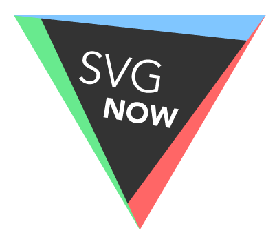
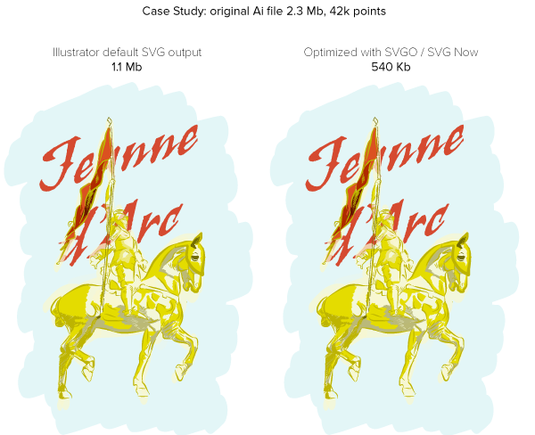
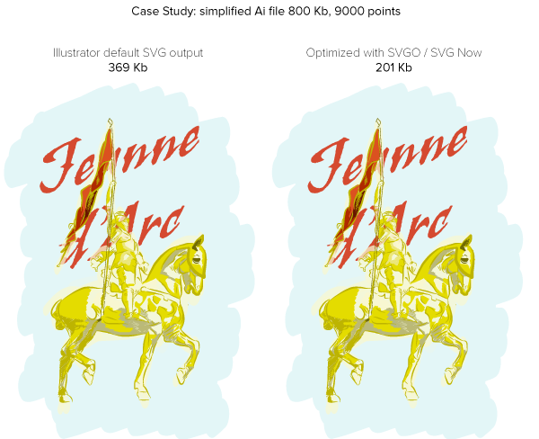
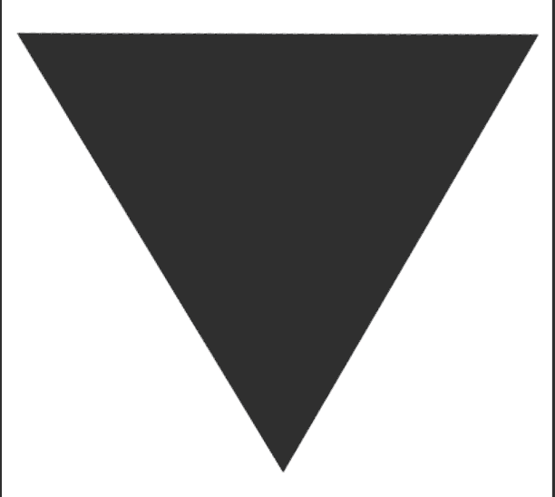

# SVG NOW for Adobe Illustrator

SVG NOW is an alternative SVG exporter for [Adobe Illustrator](http://www.adobe.com/products/illustrator.html) currently under development. It is aimed at optimizing SVG files by post-processing the generated SVG code using [SVGO](https://github.com/svg/svgo).

Creative Cloud members can install a beta version of this panel from the [creative cloud add-ons website](https://creative.adobe.com/addons/products/4272#.VGSW8VPF8Q4). It is free, open source (under MIT license) and will always be.

	Artworks in the the examples folder remain the property of their respective authors and shall not be redistributed without their permission.

## Release notes

#### v0.2 / beta 2 (Nov 18th 2014)

By popular demand, all SVGO plugins can now be enabled or disabled via checkboxes in the panel. Default values match the default values of the SVGO project.

#### v0.1 / beta 1 (Nov 10th 2014)

First beta release.

## FAQ

### Why?
A much smaller & cleaner SVG code without modifying the underlying artwork. Using default parameters, file size typically decreases by 30% - 50% depending on the nature of the artwork. Note that there is no file compression, only code optimisation.

Please note that you can definitely optimize such an artwork even further by using Illustrator's path simplication tool (*Object > Path > Simplify*) and enter a value comprised between 90% and 100%. Results can be pretty amazing. As you can see with the following example, combining both path simplification and SVGO/SVG Now optimization, you can save up to 80% (before compression) in a matter of seconds with little to no visual difference from the original artwork. Once compressed (which your webserver will probably do for you), the SVG file comes down to an impressive 73 Kb.

Also, keep in mind that fonts are outlined by default. If your artwork contains a lot of text and can deal with the obvious consequences, you should turn off this option.

### What optimizations are performed? Can this damage my artwork?

A lot of optimizations are done. Please refer to the [SVGO](https://github.com/svg/svgo) project page for more info.

If everything goes well, your artwork should not be visually modified. There are however exceptions, and you should always double check and try different option combos if necessary.

### How is that different from Illustrator's own SVG exporter?
It is built on top of Illustrator's SVG exporter, controls some of its parameters and default values, and runs the node module version of SVGO with an HTML GUI built on top of it to control all its plugins.

### How is that different from the Illustrator Layer Exporter panel?
[Illustrator Layer Exporter](https://github.com/davidderaedt/Illustrator-Layer-Exporter)'s goal is to help generating complex compositions consisting of various image files, including SVG. I guess I could include SVG Exporter in Illustrator Layer Exporter once it's mature enough, which is not the case right now. You can however post process SVG files generated by Layer Exporter with SVG Now, but you'll have to do it by yourself, manually.

### Is this an official Adobe project?

Nope, this is completely unofficial. I happen to work for Adobe, but not as a developer. I do this on my freetime.

### Can I contribute to this project?

Definitely. Since this mainly a shell on top of SVGO, if you're looking for adding new optimization or fixing related bugs or issues, please contribute to the SVGO project or its various plugins.

If you want to improve this panel (UI/UX, and any non-SVGO features) please contribute to this project directly.

