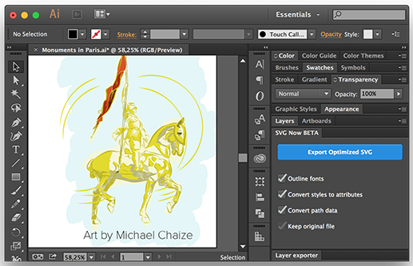

#SVG NOW for Adobe Illustrator

SVG NOW is an alternative SVG exporter for [Adobe Illustrator](http://www.adobe.com/products/illustrator.html). It is aimed at optimizing SVG files by postprocessing the generated code using [SVGO](https://github.com/svg/svgo).

SVG NOW is an in-app panel, currently in private beta, and will be distributed as a [Creative Cloud Add-on](https://creative.adobe.com/addons).

It is free, open source (distributed with an MIT license) and will always be. 

	Artworks in the the examples folder remain the property of their respective authors and shall not be redistributed without their permission.

##FAQ

###What for?
A much smaller & cleaner SVG code. Using default parameters, file size typically decreases by 30% - 50% depending on the nature of the artwork. Note that there is no file compression, only code optimisation.

###What optimizations are performed, precisely?
See the [SVGO](https://github.com/svg/svgo) project page for more info.

###How will this affect my artwork?
If everything goes well, your artwork should not be visually modified. There are however exceptions, and you should always double check and try different option combos if necessary.

###Can I optimize my file size even further?
YES! Three things:

* The first thing you should do is use Illustrator's path simplication tool (Object > Path > Simplify) and enter a value comprised between 90% and 99%. Results can be pretty amazing. 
* If your artwork contains a lot of text and can deal with the obvious consequences, you should turn off the "outline text" option.
* You can also compress the SVG after optimization, but keep in mind that most web server do that for you anyway... 

###How is that different from Illustrator's own SVG exporter?
It is built on top of Illustrator's SVG exporter, controls some of its parameters and default values, and runs a customized version of SVGO (node module) with an HTML GUI built on top of it to control its plugins.

###How is that different from the Illustrator Layer Exporter panel?
[Illustrator Layer Exporter](https://github.com/davidderaedt/Illustrator-Layer-Exporter)'s goal is to help generating complex compositions consisting of various image files, including SVG. I guess I could include SVG Exporter in Illustrator Layer Exporter once it's mature enough, which is not the case right now. You can however post process SVG files generated by Layer Exporter with SVG Now, but you'll have to do it by yourself, manually.

###How do I install it?
If you're a standard Creative Cloud user, for the time being, you have to download the ZXP file from the bin folder and install it using Extension Manager (available from your creative cloud desktop app). You'll soon be able to install it from the [Add-ons website](https://creative.adobe.com/addons).
If you're an extension developer, you can simply fork the project and install it by yourself.